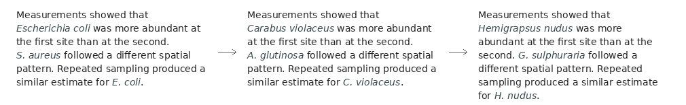
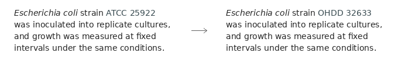

# Taxonomic Entity Augmentation (TEA)

TEA augments taxonomic entities in biological texts. It can be applied directly
to text and used to materialise augmented labelled datasets. Its two primary
transformations target potential overfitting to species and strain names.

## Species substitution

Species names can be substituted automatically in biological text.



## Strain scrambling

Strain identifiers can be scrambled while retaining their format.



For curated datasets, the augmentation pipeline can extract complete sentence
windows within a token budget and produce aligned token labels for original,
species-switched, strain-scrambled, and combined examples.

## Installation

The augmentation package is lightweight, with only one runtime dependency, and
installs directly from PyPI:

```bash
pip install taxonomic-entity-augmentation
```

## Basic usage

Any tokenizer that provides a `tokenize` method can be used. This example uses
whitespace tokenization and requires no model dependencies:

```python
from bio_tea import TEA


class WhitespaceTokenizer:
    def tokenize(self, text, **kwargs):
        return text.split()


tea = TEA(WhitespaceTokenizer(), rseed=42)

print(tea.switch("Escherichia coli was measured in culture."))
print(tea.scramble("The strain ATCC 25922 was included.", ["ATCC 25922"], force_diff=True))
```

With `transformers` installed, a Hugging Face model tokenizer can be supplied
directly:

```python
from transformers import AutoTokenizer
from bio_tea import TEA


tokenizer = AutoTokenizer.from_pretrained(
    "dmis-lab/biobert-base-cased-v1.2"
)
tea = TEA(tokenizer, rseed=42)

print(tea.switch("Escherichia coli was measured in culture."))
```

## Dataset utilities

The package also provides utilities for inspecting and validating generated
example sets. These are not required for basic augmentation.

| Command | Purpose |
| --- | --- |
| `bio-tea-inspect` | Inspect or compare labelled examples |
| `bio-tea-sample` | Export representative examples from generated datasets |
| `bio-tea-validate` | Validate one generated example set |
| `bio-tea-stats` | Summarise labels and categories in an example set |
| `bio-tea-qa` | Validate generated example sets under a results directory |
| `bio-tea-manifest-compare` | Compare training variants recorded in a dataset manifest |

Run any command with `--help` for its arguments.

### Curated dataset example

[TEA_curated_data](https://github.com/tznurmin/TEA_curated_data) provides a
complete dataset for applying these utilities to curated biological source
material. To use it, download v1.1 and select the extracted directory as the
data source:

```bash
wget https://github.com/tznurmin/TEA_curated_data/archive/refs/tags/v1.1.tar.gz -qO - | tar -xz
mv TEA_curated_data-1.1 TEA_curated_data
export TEA_CURATED_ROOT="$PWD/TEA_curated_data"
```

`TEA_CURATED_DATA` is also accepted. The external dataset is separately
licensed.

## Fine-tuning example

The [included configuration](examples/minimal-exp1) provides a compact
demonstration of the complete fine-tuning and evaluation path. It trains
BioLinkBERT base (`michiyasunaga/BioLinkBERT-base`) for one epoch on a small
prepared token-labelled dataset, then evaluates it on unaugmented and
augmented-exclusive test examples.

Install the experiment runner from a repository checkout:

```bash
git clone https://github.com/tznurmin/bio-tea.git
cd bio-tea
python -m pip install ./packages/bio-tea-runner
```

The runner installs the Hugging Face training stack. GPU execution requires a
CUDA-enabled PyTorch installation for the local system.

```bash
bio-tea-runner-exp1 \
  --config examples/minimal-exp1/config.yaml \
  --source-root examples/minimal-exp1/source \
  --tasks example \
  --sets set1 \
  --seeds 1 \
  --epochs 1 \
  --summary-out examples/minimal-exp1/results/summary.json \
  --report-out examples/minimal-exp1/results/report.json
```

Main outputs:

```text
examples/minimal-exp1/results/summary.json
examples/minimal-exp1/results/report.json
```

Detailed run artifacts are written under:

```text
examples/minimal-exp1/results/profiles/
```

Fine-tuned model weights are not saved.

## Experiment runner

For more involved experiments, use the provided
[experiment runner package](packages/bio-tea-runner) to configure and execute
model training and evaluation, validate run artifacts, and produce aggregate
reports. It is a separate component; the augmentation library can be used
independently for text augmentation and dataset materialisation.

The runner can coordinate experiment matrices across tasks, dataset variants,
models, sets, random seeds, and hyperparameters, with calibration and resumable
execution.

## Licence

- Code: [Apache License 2.0](LICENSE)
- Vendored UniProt organism list: [Creative Commons Attribution 4.0](https://creativecommons.org/licenses/by/4.0/),
  with details in the [data attribution file](packages/bio-tea/src/bio_tea/data/attribution.txt)
- Downloaded [TEA_curated_data](https://github.com/tznurmin/TEA_curated_data)
  material is external and separately licensed
